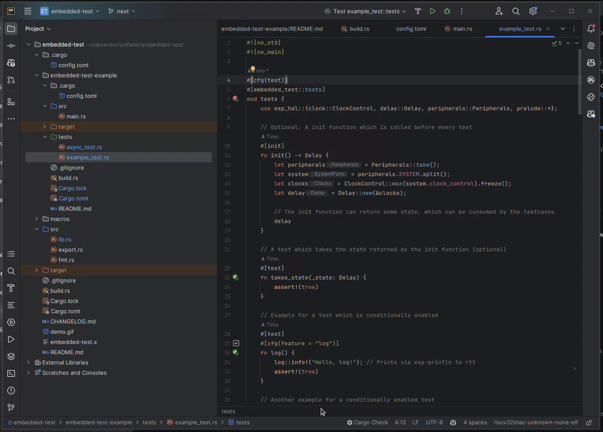

# Embedded Test

[](https://crates.io/crates/embedded-test)


The embedded-test library provides a test harness for embedded systems (riscv and arm). It is based on the idea of [defmt-test](https://crates.io/crates/defmt-test).

`probe-rs test` provides a (libtest compatible) test runner, which will:
1. Flash all the tests to the device in one go (via probe-rs)
2. Request information about all tests from the device (via semihosting SYS_GET_CMDLINE)
3. In turn for each testcase: 
   - Reset the device
   - Signal to the device (via semihosting SYS_GET_CMDLINE) which test to run
   - Wait for the device to signal that the test completed successfully or with error (via semihosting SYS_EXIT)
4. Report the results

Since the test runner (`probe-rs test`) is libtest compatible (using [libtest-mimic](https://crates.io/crates/libtest-mimic)), you can use intellij or vscode to run individual tests with the click of a button.




## WARNING
This project is in development state. Don't rely on it for anything important yet.

## Features
* Runs each test case individually, and resets the device between each test case 
* Supports an init function which will be called before each test case and can pass state to the test cases
* Supports async test and init functions (needs feature `embassy`)
* Support `#[should_panic]`, `#[ignore]` and `#[timeout(<seconds>)]` attributes for each test case

## Usage

Add the following to your `Cargo.toml`:

```toml
[[test]]
name = "example_test"
harness = false

[dev-dependencies]
embedded-test = {version="0.2.2", features = ["log"]} # enable log or defmt to see some debug output

# You need a panic handler that invokes `semihosting::process::abort()` on exit.
# For example: Use the patched panic-probe:
panic-probe = {git = "https://github.com/t-moe/defmt", features=["print-log"]}  # the upstream create does not use semihosting yet
# NOTE: When you use the patched panic-probe, you'll also need to:
# * provide your own exception handler, as panic_probe no longer provides this
# * patch defmt globally, as it is a native library (see below)

[patch.crates-io]
defmt = { git = "https://github.com/t-moe/defmt" }
defmt-rtt = { git = "https://github.com/t-moe/defmt" }
```

Install the runner on your system:
```bash 
cargo install probe-rs --git https://github.com/probe-rs/probe-rs --branch feature/testing --features cli --bin probe-rs
```

Add the following to your `.cargo/config.toml`:

```toml
[target.riscv32imac-unknown-none-elf]

# Syntax is: probe-rs test <flash settings> -- <elf> <libtest args>
runner = "probe-rs test --chip esp32c6 -- "
```

Then you can run your tests with `cargo test` or use the button in vscode/intellij.

## Example Test

[Example repo](https://github.com/probe-rs/embedded-test-example)  
[More Detailed Cargo.toml](https://github.com/probe-rs/embedded-test-example/blob/master/Cargo.toml)

Example for `tests/example_test.rs`

```rust 
#![no_std]
#![no_main]

#[cfg(test)]
#[embedded_test::tests]
mod unit_tests {

   // import hal which provides exception handler
   use esp32c6_hal::{clock::ClockControl, peripherals::Peripherals, prelude::*, IO};

   use panic_probe as _; // calls semihosting::process::abort on test failure, printing is done by probe-rs

   // Optional: A init function which is called before every test
   // asyncness is optional and needs feature embassy
   #[init]
   async fn init() -> IO {
      let peripherals = Peripherals::take();
      let system = peripherals.SYSTEM.split();
      ClockControl::boot_defaults(system.clock_control).freeze();
      let io = IO::new(peripherals.GPIO, peripherals.IO_MUX);

      #[cfg(feature = "log")]
      esp_println::logger::init_logger_from_env();

      // NOTE: The init function can return some state, which can be consumed by the testcases
      // You can also implement a drop guard for the state, which enables you to run some cleanup code after the testcases
      io
   }

   // A test which takes the state returned by the init function (optional)
   // asyncness is optional and needs feature embassy
   #[test]
   async fn takes_state(_state: IO) {
      assert!(true)
   }

   // Example for a test which is conditionally enabled
   #[test]
   #[cfg(feature = "log")]
   fn log() {
      log::info!("Hello, log!"); // Prints via esp-println to rtt
      assert!(true)
   }

   // Another example for a conditionally enabled test
   #[test]
   #[cfg(feature = "defmt")]
   fn defmt() {
      use defmt_rtt as _;
      defmt::info!("Hello, defmt!"); // Prints via defmt-rtt to rtt
      assert!(true)
   }

   // A test which is cfg'ed out
   #[test]
   #[cfg(abc)]
   fn it_works_disabled() {
      assert!(false)
   }

   // Tests can be ignored with the #[ignore] attribute
   #[test]
   #[ignore]
   fn it_works_ignored() {
      assert!(false)
   }

   // A test that fails with a panic
   #[test]
   fn it_fails1() {
      assert!(false)
   }

   // A test that fails with a returned Err()
   #[test]
   fn it_fails2() -> Result<(), ()> {
      Err(())
   }

   // Tests can be annotated with #[should_panic] if they are expected to panic
   #[test]
   #[should_panic]
   fn it_passes() {
      assert!(false)
   }

   // This test should panic, but doesn't => it fails
   #[test]
   #[should_panic]
   fn it_fails3() {}

   // Tests can be annotated with #[timeout(<secs>)] to change the default timeout of 60s
   #[test]
   #[timeout(10)]
   fn it_timeouts() {
      loop {} // should run into the 60s timeout
   }
}
```

## License

Licensed under either of:

- Apache License, Version 2.0 (http://www.apache.org/licenses/LICENSE-2.0)
- MIT license (http://opensource.org/licenses/MIT)

at your option.

### Contribution

Unless you explicitly state otherwise, any contribution intentionally submitted for inclusion in
the work by you, as defined in the Apache-2.0 license, shall be dual licensed as above, without
any additional terms or conditions.

